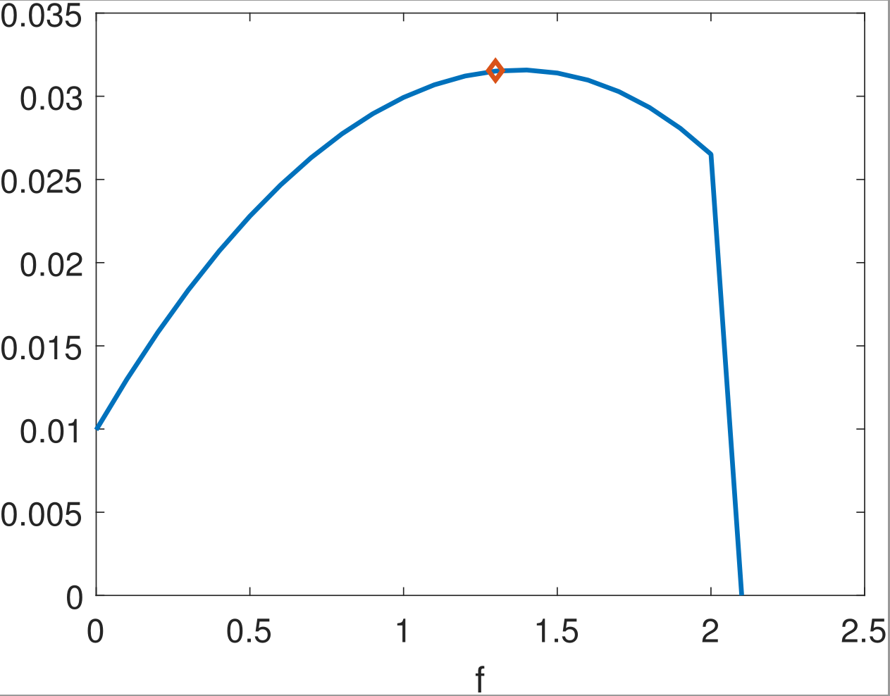
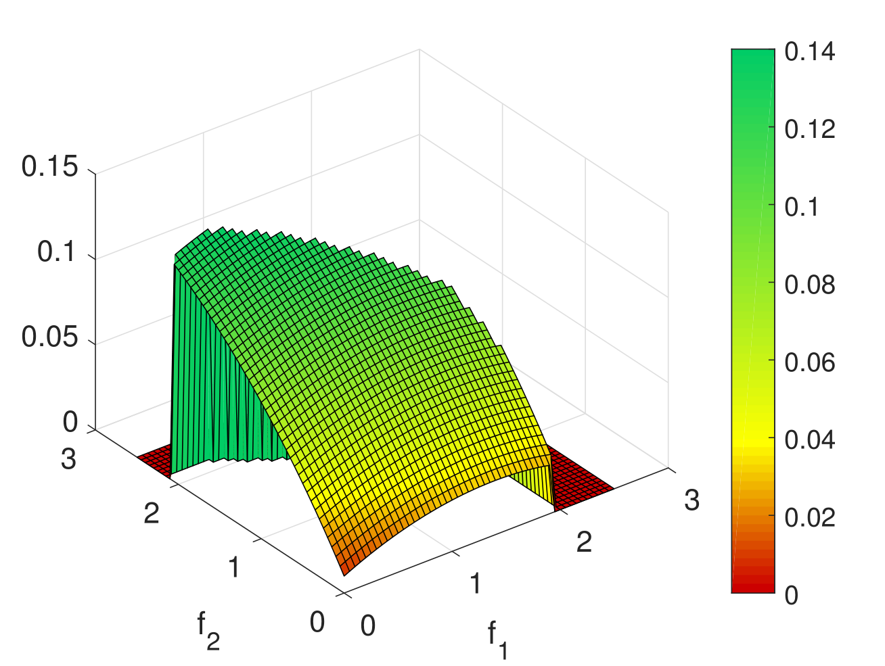

[](http://quantlet.de/)

## [](http://quantlet.de/) **Kelly_Gaussian** [](http://quantlet.de/)

```yaml

Name of Quantlet : Kelly_Gaussian

Published in : Metis

Description : Kelly_Bernoulli illustrates growth-optimal betting under repeated Bernoulli trials

Keywords : kelly, growth-optimal, transmission rate, blackjack, thorp

See also : Kelly_Bernoulli_GUI, Kelly_Gaussian, Stable_Kelly_Rescaling

Author : NW

Submitted : 2016-10-09

Example : 1.png, 2.png

```






### MATLAB Code:
```matlab
%% Kelly under normal
% Merton approximation vs. numerical

%% Global commands

% ver % verify the version of Matlab
clear;clc; % clear

% set global commands for font size and line width
size_font=14;
size_line=2;
set(0,'DefaultAxesFontSize',size_font,'DefaultTextFontSize',size_font);
set(0,'defaultlinelinewidth',size_line)

%% Data simulation

% number of simulation
n=10^6;

% log-returns, normally distributed
x_log=0.03+0.15*randn(n,1); % use any simulation method you want

% discrete returns
x_discrete=exp(x_log)-1;

%% Wealth calculation

% starting wealth
W_t=1000;

% risk free rate
rf=0.01;

% closed-form merton without risk-free rate
f_merton=(mean(x_discrete)-rf)/(var(x_discrete));
f_rf=1-f_merton;

% fraction interval
f_raw=[0:0.1:2.1]';
f=[f_raw 1-f_raw];


for i=1:length(f_raw)
    W_T(:,i)=W_t*(1+f(i,1).*x_discrete+f(i,2).*rf);
end
W_T(W_T<0)=0;
W_Elog=mean(log(W_T/W_t));
W_Elog(W_Elog<0)=0;
[W_Elog_max,index_max]=max(W_Elog);

% wealth for merton portfolio
W_T_merton=W_t*(1+f_merton.*x_discrete+f_rf*rf);
W_Elog_merton=mean(log(W_T_merton/W_t));


%% Figure

h=figure()
plot(f_raw,W_Elog);hold all;
plot(f_merton,W_Elog_merton,'d'); hold off;
xlabel('f');%ylabel('E[log(W_T/W_t)]')
%title('Optimaler Einsatz f?r ein Asset')
%print(h,'-depsc','-r300','kelly_gaussian')


%% 2D

n=10^6;
rf=0.01;
x_log=repmat([0.03 0.08],n,1)+mvnrnd([0 0],[1 0 ; 0 1],n)*[0.15 0 ; 0 0.15];
x_discrete=exp(x_log)-1;

[f1,f2] = meshgrid(0:0.05:2.5,0:0.05:2.5);

for i=1:length(f1)
    for j=1:length(f2)
g(i,j)=max(0,mean(log(wealth(f1(i,j),f2(i,j),x_discrete,rf))));
    end
end
surf(f1,f2,g); hold on;
xlabel('f_1');ylabel('f_2');zlabel('g(f_1,f_2)')

%f_merton=(mean(x_discrete)-rf)/(cov(x_discrete));
%g_opt=rf+f_merton*cov(x_discrete)*f_merton'/2;
%plot3(f_merton(1),f_merton(2),g_opt,'d')
```
